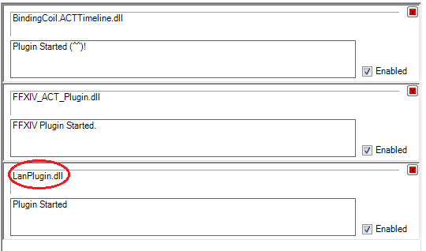
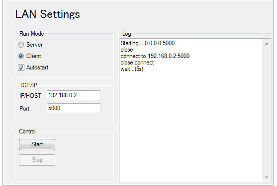

ACT LAN Plugin
==============
Advanced Combat TrackerのログをLAN内で共有するプラグイン  
2台以上のパソコンでACTのログをリアルタイムで共有可能にします

##注意事項
  
必ずLanPlugin.dllが一番下に登録されている必要があります  
既存プラグインを登録し直すか、Advanced Combat Tracker.config.xmlで

##Screenshot
  
port番号はご自由に
